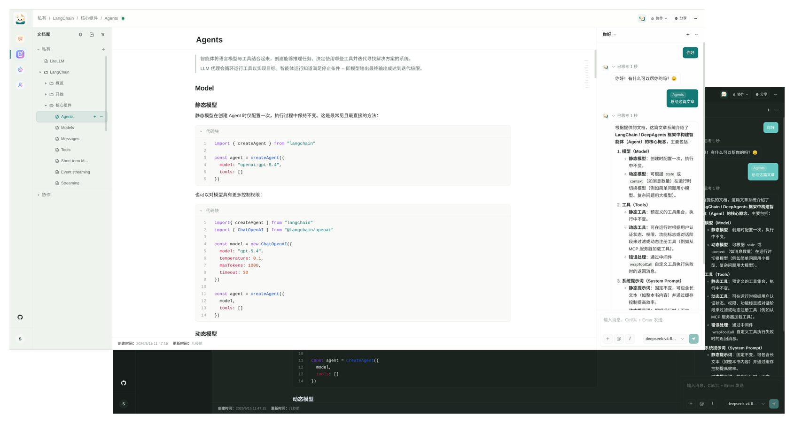

<p align="center">
  
</p>

<h1 align="center">SamePage AI</h1>

<p align="center">
  <a href="./README.md">中文</a> · <strong>English</strong>
</p>

<p align="center">
  AI and collaboration, on the same page.
</p>

<p align="center">
  <a href="https://github.com/haohaoxue-site/SamePage-AI/blob/master/LICENSE"></a>
  
  
  
  
</p>

SamePage AI is an online collaborative document platform for individuals, small teams, and communities. It brings document writing, AI chat, multi-user collaboration, and public publishing into one workspace, so knowledge capture, collaborative editing, and AI-assisted writing can happen in the same page context.

> This project is still under active development. Protocols, data structures, and product behavior may continue to change.



## Core Capabilities

| Capability | Description |
| --- | --- |
| AI Chat | Model selection, streaming responses, message branches, retry flows, and document-aware context. |
| Document Writing | Page trees, rich text blocks, tables, code blocks, math, version history, and trash. |
| Document Collaboration | User invites, collaboration links, read/write permissions, and child-page access scopes. |
| Public Publishing | Single-page publishing and site publishing with VitePress-like public pages. |
| BYOK Model Access | Platform-level or user-level model providers with OpenAI-Compatible and Anthropic-Compatible endpoints. |

## Tech Stack

| Layer | Technology |
| --- | --- |
| Web | Vue 3, Vite, Vue Router, Pinia, Element Plus, UnoCSS |
| Editor | Tiptap, ProseMirror, Yjs, Hocuspocus Provider |
| API | NestJS, Fastify, Prisma, PostgreSQL, Redis, BullMQ |
| Collab | Hocuspocus Server, Yjs, Redis permission invalidation |
| Agent | LangGraph, LangChain, Postgres Checkpointer, Redis queues |
| Contracts | Zod, shared endpoint registry, domain constants and types |
| Infrastructure | Docker Compose, RustFS, Nginx |

## Project Structure

```txt
samepage-ai/
├── apps/
│   ├── web/         # Vue 3 frontend app
│   ├── api/         # NestJS API service
│   ├── collab/      # Hocuspocus / Yjs collaboration service
│   ├── agent/       # LangGraph AI runtime service
│   └── docs/        # Product documentation site
├── packages/
│   ├── contracts/   # Shared schemas, endpoints, constants, and domain types
│   └── shared/      # Shared utility functions
└── infrastructure/  # Docker and environment configuration
```

## Local Development

SamePage AI uses pnpm workspace.

```bash
pnpm install
pnpm dev:infra
cp apps/api/.env.example apps/api/.env
cp apps/collab/.env.example apps/collab/.env
cp apps/agent/.env.example apps/agent/.env
pnpm dev:db:sync
pnpm dev
```

At minimum, `apps/api/.env` needs `APP_SECRET`, `SYSTEM_ADMIN`, `STORAGE_ACCESS_KEY`, and `STORAGE_SECRET_KEY`.

## License

SamePage AI is licensed under [AGPL-3.0-only](LICENSE).

## Friendly Links

- [LINUX DO - A new ideal community](https://linux.do/)
