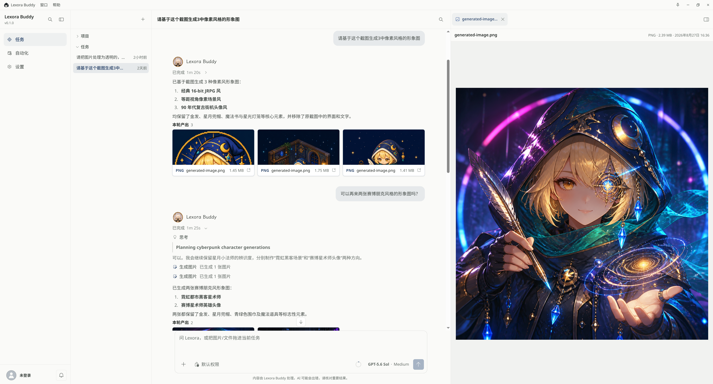
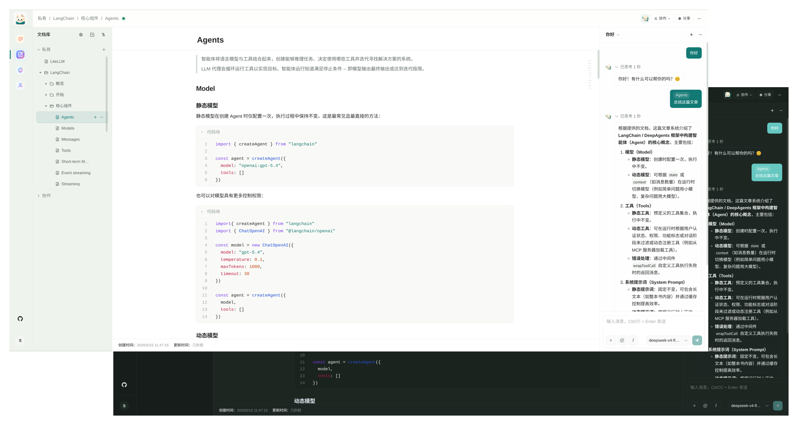

<p align="center">
  
</p>

<h1 align="center">Lexora 文灵</h1>

<p align="center">
  <a href="./README.md">中文</a> · <strong>English</strong>
</p>

<p align="center">
  Let words be where work, creativity, and everyday life begin.
</p>

<p align="center">
  
  <a href="https://github.com/haohaoxue-site/Lexora/blob/master/LICENSE"></a>
  
  
  
</p>

<p align="center">
  <a href="https://haohaoxue-site.github.io/Lexora/en/">Documentation</a>
  ·
  <a href="https://github.com/haohaoxue-site/Lexora/releases/latest">Download Lexora Desktop</a>
  ·
  <a href="https://docs.haohaoxue.site/">Website</a>
</p>

Lexora is a personal AI workspace built around Desktop. Within the access you grant, it uses local files and tools to think alongside you and act on your intent.

## Desktop

Desktop runs locally and is organized around tasks, bringing conversations, local context, tool execution, automations, and artifacts together in one workspace.



### Core Capabilities

| Capability | Description |
| --- | --- |
| Task Workspace | Start tasks in natural language and keep execution progress, run history, and generated artifacts together. |
| Local Context | Understand and work with documents, images, files, and code in authorized directories. |
| Tools and Control | Connect multiple models, use Skills, MCP, and local tools, and request confirmation before sensitive operations. |
| Automations | Create scheduled and recurring tasks while retaining the process and result of each run. |
| Desktop Feedback | Present task status through notifications and a native desktop pet. |

### Tech Stack

| Layer | Technology |
| --- | --- |
| Desktop | Electron, Vue 3, TypeScript, Vite, Naive UI, UnoCSS |
| Agent Runtime | Pi SDK, MCP SDK, Node.js, SQLite, JSONL |
| Native Pet | Rust, GTK, Cairo, GDK Pixbuf |

### Local Development

```bash
pnpm install
pnpm dev:buddy
```

## Web

Web will gradually become Desktop's content extension for document editing, knowledge capture, and public publishing. It currently runs independently and supports self-hosting.



### Core Capabilities

Page trees, rich-text editing, document AI, version history, single-page publishing, and site publishing.

### Tech Stack

| Layer | Technology |
| --- | --- |
| Web | Vue 3, TypeScript, Vite, Vue Router, Pinia, Element Plus, UnoCSS |
| Editor | Tiptap, ProseMirror |
| API | NestJS, Fastify, Prisma, PostgreSQL, Redis, BullMQ |
| Agent | LangGraph, LangChain, PostgreSQL Checkpointer, Redis Streams |
| Infrastructure | Docker Compose, Nginx, RustFS |

### Local Development

```bash
pnpm install
cp infrastructure/.env.dev.example infrastructure/.env
pnpm dev:infra
pnpm dev:db:sync
pnpm dev
```

`infrastructure/.env` is the local configuration source of truth. `pnpm dev` generates the API and Agent environment files from its allowlist.

## Project Structure

```txt
lexora/
├── apps/
│   ├── web/         # Vue 3 frontend app
│   ├── api/         # NestJS API service
│   ├── agent/       # LangGraph AI runtime service
│   ├── buddy/       # Lexora Desktop
│   └── website/     # Product landing and documentation site
├── packages/
│   ├── assets/      # Cross-app brand and runtime assets
│   ├── contracts/   # Shared schemas, endpoints, constants, and domain types
│   └── shared/      # Shared utility functions
└── infrastructure/  # Docker and environment configuration
```

## License

Lexora is licensed under [AGPL-3.0-only](LICENSE).

## Friendly Links

- [LINUX DO - A new ideal community](https://linux.do/)
